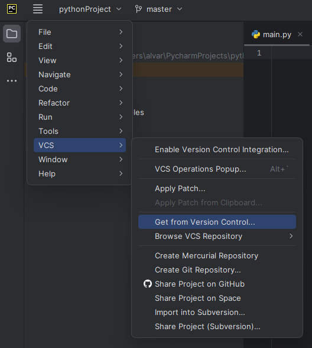
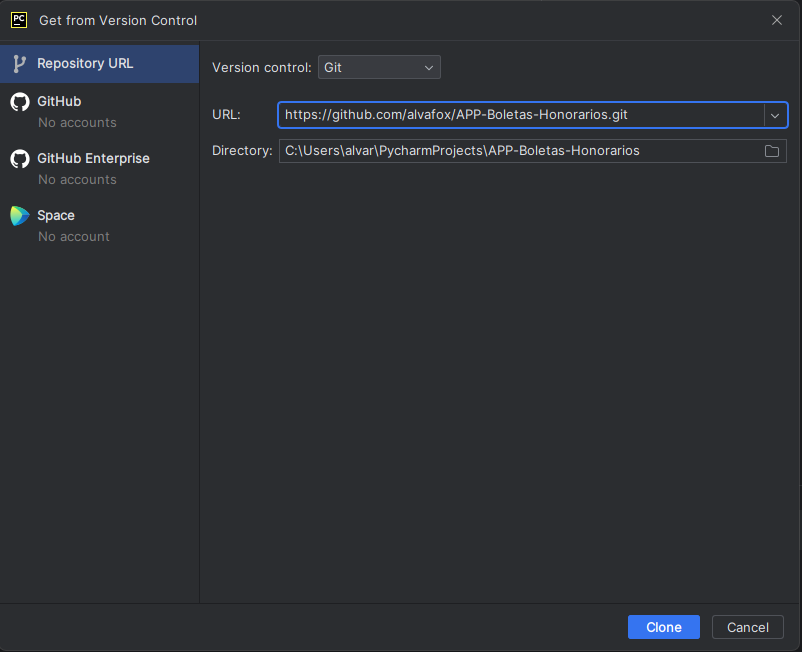

# APP-Boletas-Honorarios

APP para la lectura de boletas de honorarios emitidas por el SII en formato PDF.

La aplicacion puede leer masivamente boletas de honorarios para dejar los datos en una planilla Excel.

# 0 - Clonar el repositorio en la versión de escritorio de Pycharm.

<div align="center">
    
</div>

Ingresar la URL del proyecto y luego presionar el botón CLONE.
<div align="center">
    
</div>

# 1 - Instalar librerías del proyecto.

Luego de clonar el repositorio, es necesario installar las librerias que permitiran usar las funciones del archivo main.py. Executar la siguiente línea en la consula del entorno virtual del proyecto.

```
pip install -r requirements.txt
```

# 2 - Encapsular el proyecto para producir el archivo autoejecutable (.EXE).

En la consola es necesario ejecutar la siguiente línea: 
```
pyinstaller --onefile --name "APP BOLETAS (NUEVO)" --hiddenimport win32timezone -F --add-data "Gui.ui;ui" main.py

```

Luego en la capreta dist estará un archivo autoejecutable que puede buscar y registrar las boletas de honorarios. 

<div align="center">
    
</div>

# 3 - Se produce la APP en la carpeta "dis".

Se llevará a cabo el encapsulamiento del proyecto, mediante el nombre que se definió en el paso anterior "--name "APP BOLETAS (NUEVO)".

Es importante que la aplicación de OUTLOOK este instalada en el escritorio del computador y las boletas deben estar almacenadas en la carpeta por defecto ("Bandeja de entrada"). Cualquier otra boleta que no esté dicha carpeta por defecto, no será descargada. En la APP, seleccionar el rango de fechas para descargar todos los archivos adjuntos en PDF.

<div align="center">
    
</div>

# 4 - Lectura de Boletas

Una vez que se descargaron todos los archivos .PDF de la bandeja de entrada, es necesario eliminar los documentos que no sean boletas de honorarios. Una vez que en la carpeta se cuente solo con boletas de honorarios, presionar el botón "Generar EXCEL", mediante esta lectura se genera la planilla para gestionar la información.

<div align="center">
    
</div>

# 5 - Tabulación de datos

El producto es una planilla Excel, mediante la cual se facilitara la gestion masiva de Boletas de Honorarios.

<div align="center">
    
</div>
