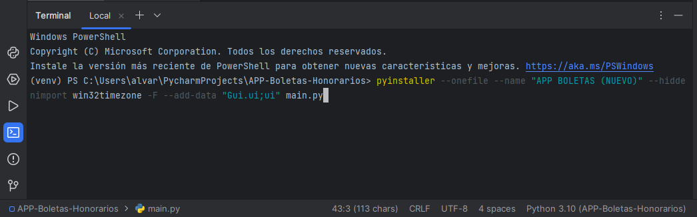
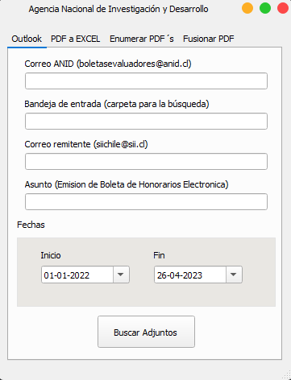
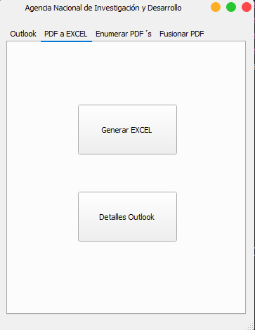
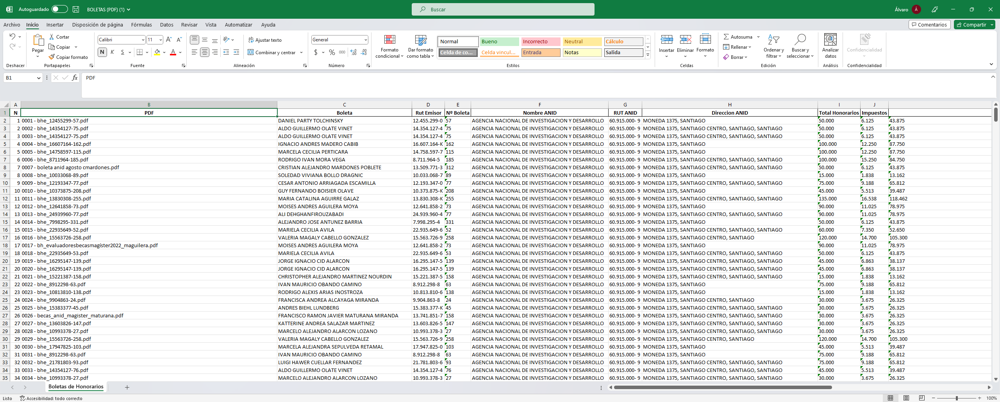

# APP-Boletas-Honorarios

APP para la lectura de boletas de honorarios emitidas por el SII en formato PDF.

La aplicacion puede leer masivamente boletas de honorarios para dejar los datos en una planilla Excel.

En la consola es necesario ejecutar la siguiente linea: pyinstaller --onefile --name "APP BOLETAS (NUEVO)" --hiddenimport win32timezone -F --add-data "Gui.ui;ui" main.py

Luego en la capreta dist estará un archivo autoejecutable que puede buscar y registrar las boletas de honorarios. Es importante que la aplicación de OUTLOOK este instalada en el escritorio del computador y las boletas deben estar almacenadas en la carpeta por defecto. Por ejemplo, la "Bandeja de entrada". Cualquier otra boleta que no esté dicha carpeta por defecto, no será descargada.

1 - Aplicar la linea en la consola.

    

2 - Se produce la APP en la carpeta "dis".

    

3 - Lectura de Boletas

    

4 - Tabulación de datos

    

