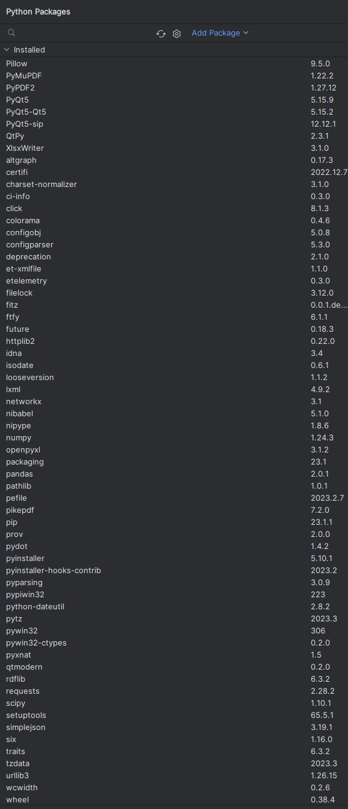

# APP-Boletas-Honorarios

APP para la lectura de boletas de honorarios emitidas por el SII en formato PDF.

La aplicacion puede leer masivamente boletas de honorarios para dejar los datos en una planilla Excel.

# 0  Clonar el repositorio en la versión de escritorio de Pycharm.

    

# 1 Luego de clonar el repositorio, es necesario installar las librerias que permitiran usar las funciones del archivo main.py. 

    

En la consola es necesario ejecutar la siguiente línea: pyinstaller --onefile --name "APP BOLETAS (NUEVO)" --hiddenimport win32timezone -F --add-data "Gui.ui;ui" main.py

Luego en la capreta dist estará un archivo autoejecutable que puede buscar y registrar las boletas de honorarios. Es importante que la aplicación de OUTLOOK este instalada en el escritorio del computador y las boletas deben estar almacenadas en la carpeta por defecto. Por ejemplo, la "Bandeja de entrada". Cualquier otra boleta que no esté dicha carpeta por defecto, no será descargada.

# 2 - Aplicar la línea en la consola.

Una vez clonado el repositorio en Pycharm, se deben instalar todas las librerias asociadas al proyecto.

    

# 3 - Se produce la APP en la carpeta "dis".

Seleccionar el rango de fechas para descargar todos los archivos adjuntos en PDF.

    

# 4 - Lectura de Boletas

Presionar el botón "Generar EXCEL", mediante esta lectura se genera la planilla para gestionar la información.

    

# 5 - Tabulación de datos

El producto es una planilla Excel, mediante la cual se facilitara la gestion masiva de Boletas de Honorarios.

    

